# Работа с уровнями изоляции транзакции в PostgreSQL

1. Поставил Ubuntu 20.04 как под систему Windows для Linux (WSL)
2. Сгенерировал ssh ключи 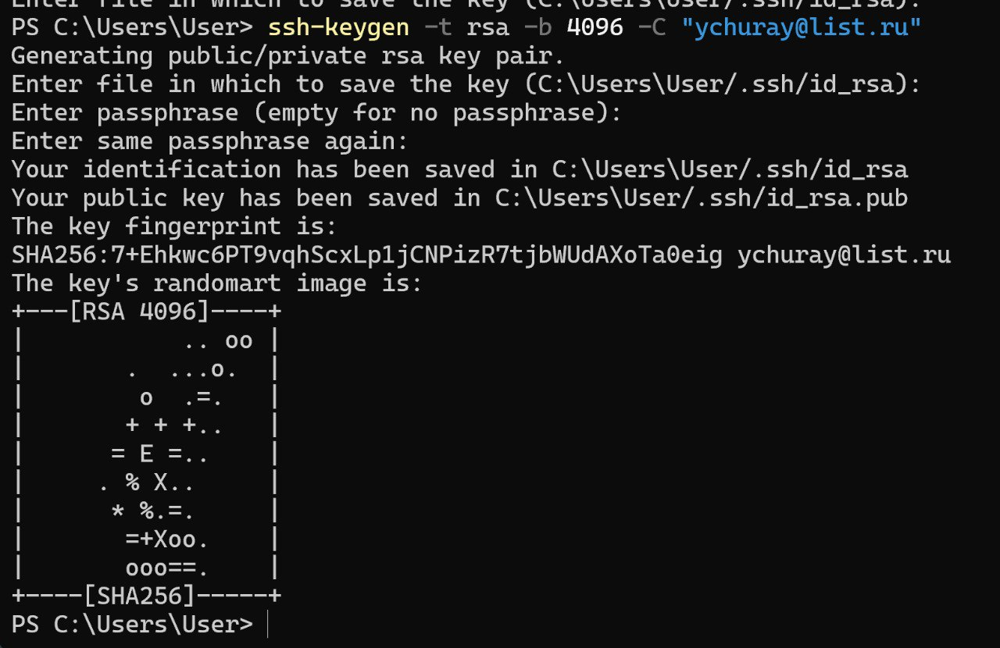
3. Добавил ключ в authorized_keys 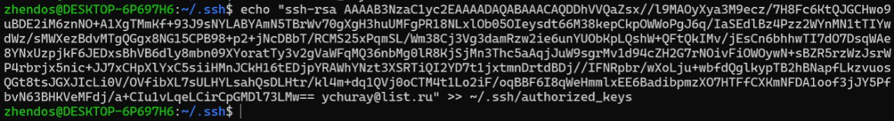
4. Отключил авторизацию по паролю и включил авторизацию по ключу 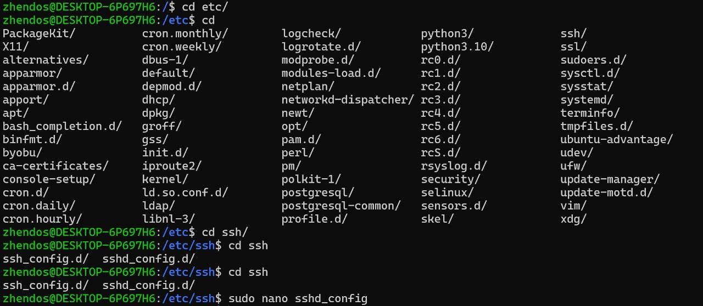 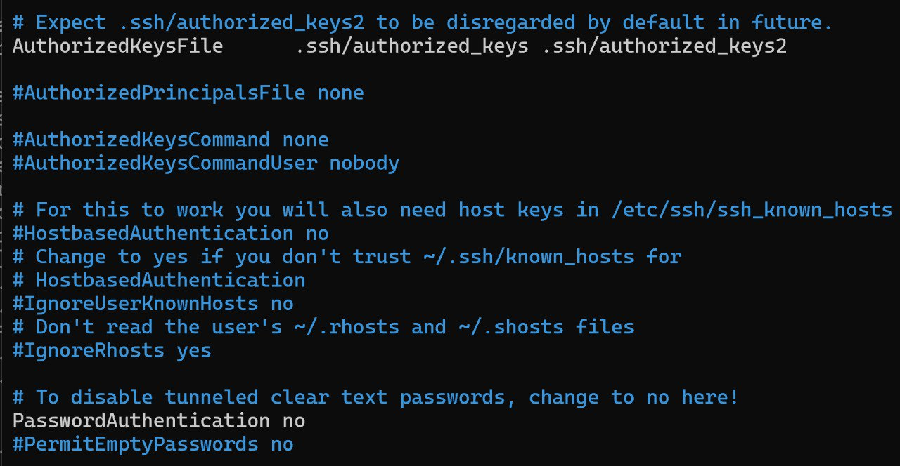
5. Сначала отправил файл с неверным ssh ключом и получил отказ в доступе 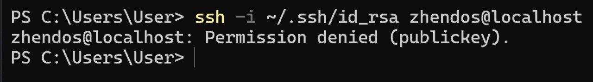
6. Потом сделал подключение через верный ключ и получил доступ к ВМ и зашел внутрь(первая сессия)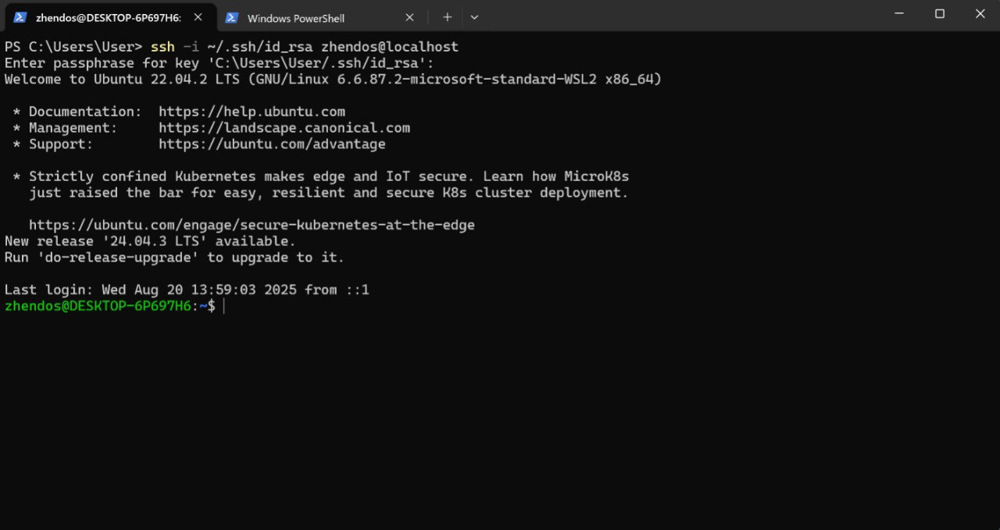
7. Поставил 3 разные версии PostgreSQL, запустил 3 кластера и поделал различные операции по ним(в конце 17 оставил включенным) 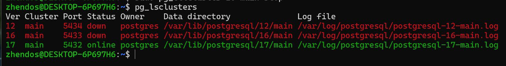 
8. Зашёл во вторую сессию 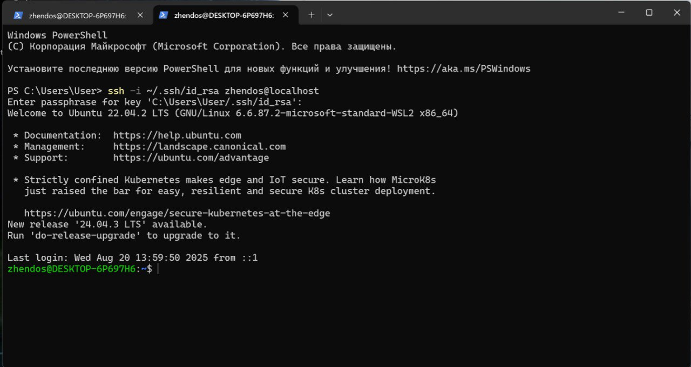
9. Запустил везде psql 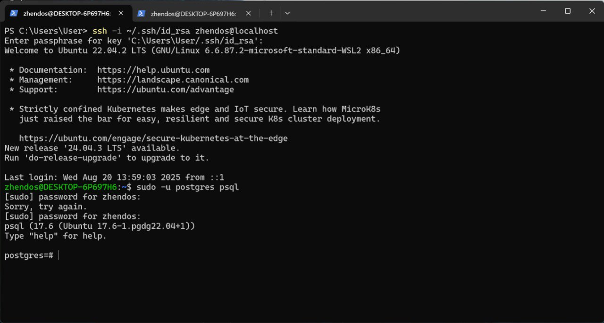 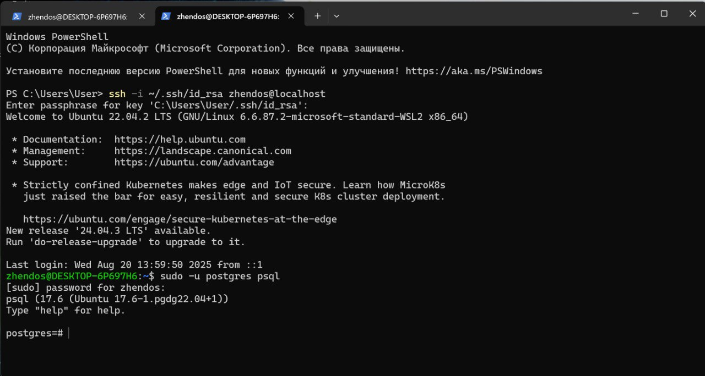
10. В первой сессии создал новую таблицу и наполнил её данными 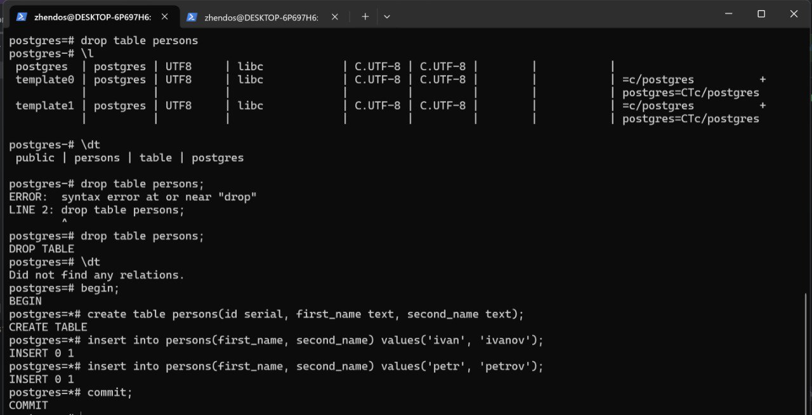
11. Посмотрел уровень изоляции по умолчанию в PostgreSQL 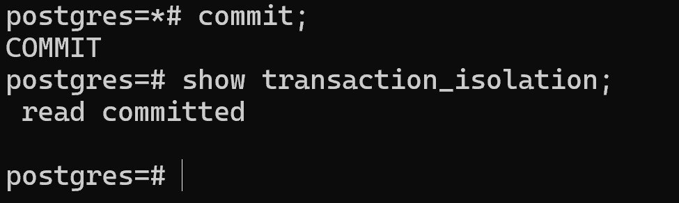
12. В первой сессии добавил новую запись в таблицу 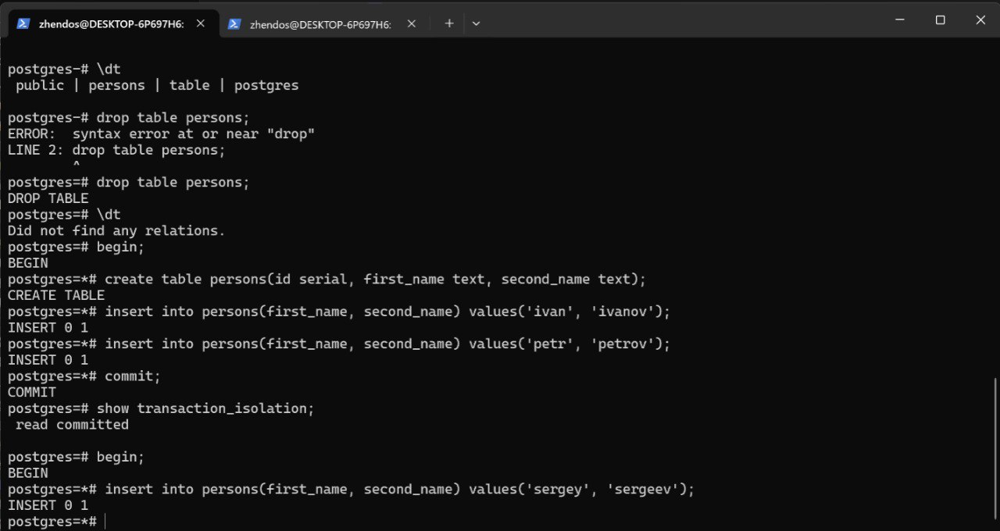
13. Сделал селект в другой сессии(не получил новую запись, так как транзация не завершена в первой сессии, а уровень изоляции по умолчанию READ COMMITTED) 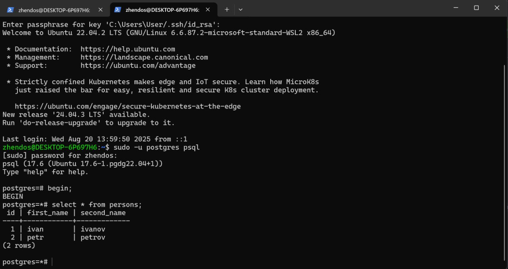 
14. Завершаю первую транзакцию и снова делаю селект в другой сессии(получил новую запись) 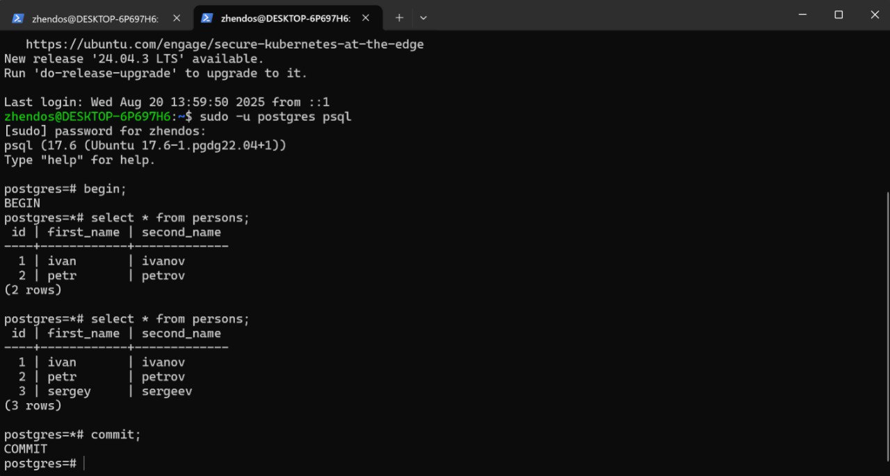
15. Меняю для сессий уровень изоляции на REPEATABLE READ 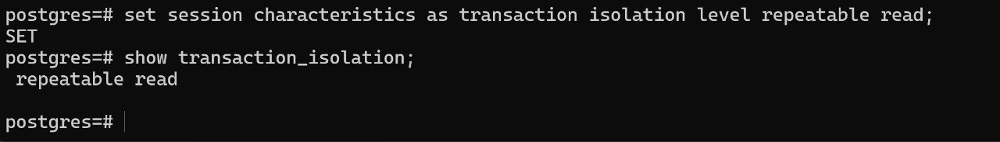
16. В первой сессии добавил новую запись в таблицу 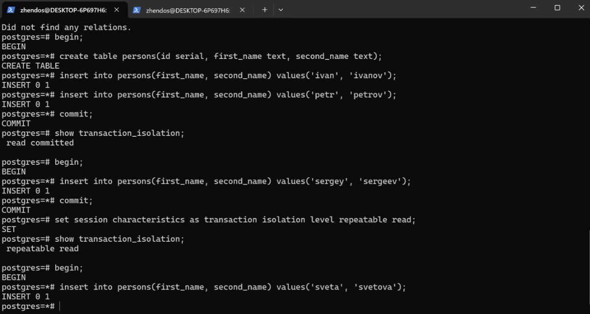
17. Сделал селект в другой сессии(не получил новую запись, так как уровень изоляции REPEATABLE READ, и селект сделан до завершения первой транзакции) 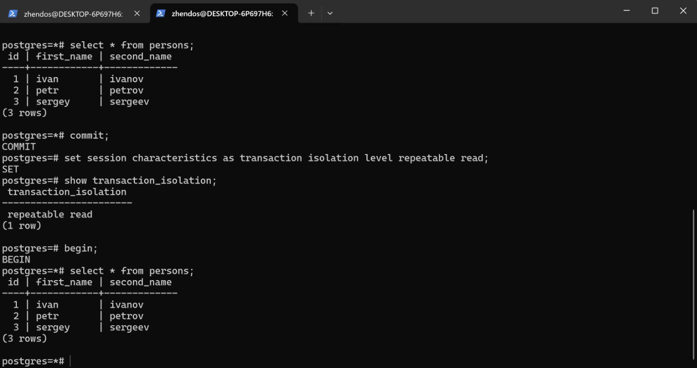
18. Завершил первую транзакцию и снова делаю селект в другой сессии(не получил новую запись, так как селект сделан в незавершенной транзакции и уровень изоляции REPEATABLE READ решает проблему аномалии неповторяющегося чтения) 
19. Завершаю вторую транзакцию и делаю новый селект(получил новую запись) 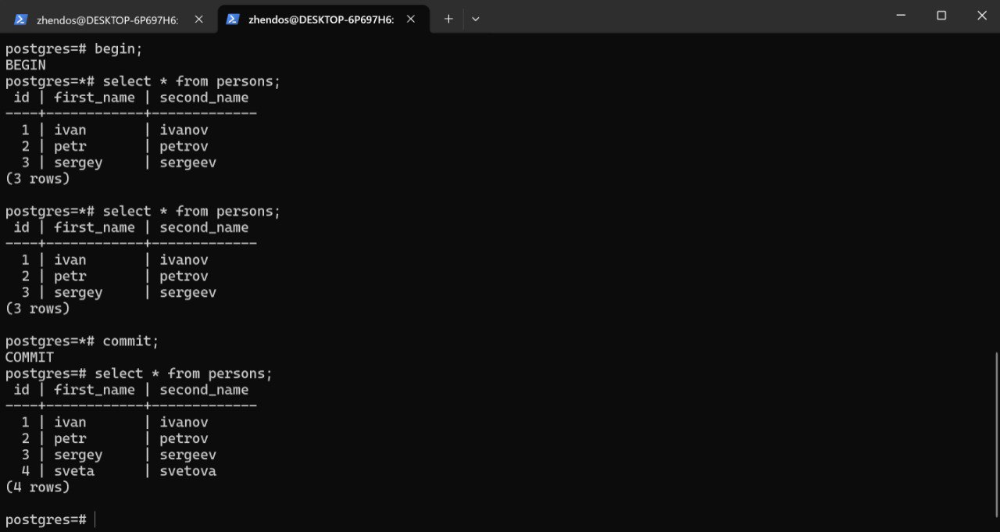