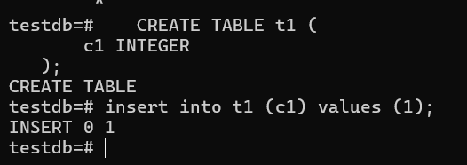
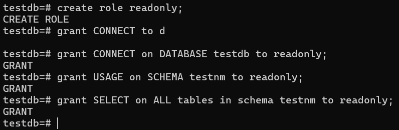
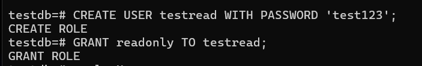
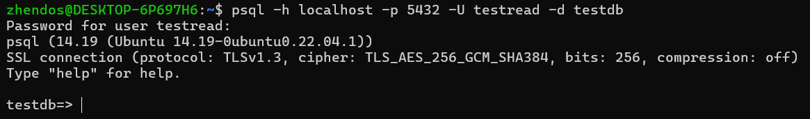
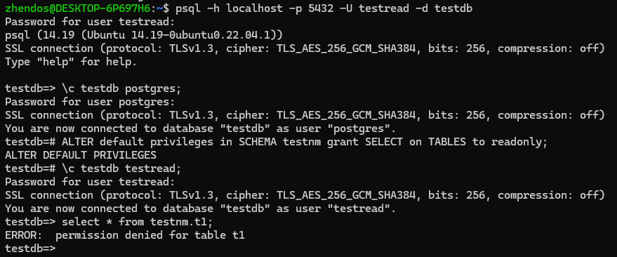

# Работа с базами данных, пользователями и правами

1. Зашёл в созданный кластер под пользователем postgres и создал новую базу данных testdb 
2. Зашёл в созданную базу данных под пользователем postgres и созздал новую схему testnm  
3. Создал новую таблицу t1 с одной колонкой c1 типа integer и добавил строку со значением c1=1 
4. Создал новую роль readonly и дал новой роли право на подключение к базе данных testdb, на использование схемы testnm, на select для всех таблиц схемы testnm 
5. Создал пользователя testread с паролем test123 и дал ему роль readonly пользователю testread 
6. Подключился под пользователем testread в базу данных testdb и сделал select * from t1  
7. Отказано в правах доступа, так как при создании таблицы не была указана схема, в которой будет данная таблица, а по умолчанию всегда стоит схема public, к которой мы не дал доступа пользователю testread
8. Зашёл в базу данных testdb под пользователем postgres и удалил таблицу t1, создал ее заново но уже с явным указанием имени схемы testnm и вставил строку со значением c1=1 зашёл под пользователем testread в базу данных testdb и сделал select * from testnm.t1  
9. Отказано в правах доступа, так как ранее данные права на select были установлены только для таблиц созданных в схеме testnm на тот момент, когда мы выдавили права, а та таблица t1 была удалена
10. После использования команды ALTER default privileges проблема не решилась, так как она применится для новых созданных таблиц в схеме testnm 
11. Поэтому пересоздадим таблицу заново и получим результат 
12. Выполнил команду create table t2(c1 integer); insert into t2 values (2) 
13. Всё успешно создалось, так как новые созданные пользователи по умолчанию получают роль public и могут пользоваться схемой public
14. Чтоб решить эту проблему, можно просто отменить права на создание таблиц для роли public в схеме public 