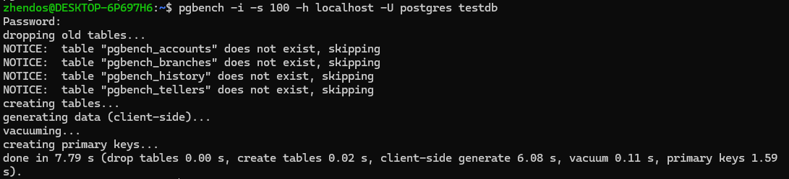
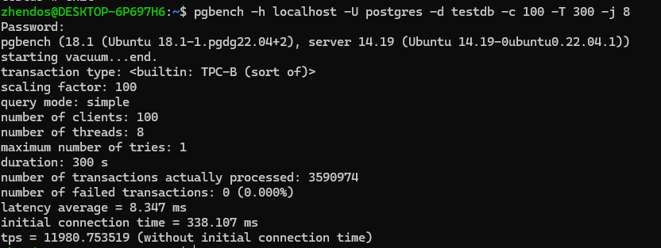

# Работа с базами данных, пользователями и правами

1. Развернул кластер PostgreSQL 15 с помощью WSL
2. Настроил на максимальную производительность, а именно в файле postgresql.conf сделал следующее:

- shared_buffers = 4GB(Это объем памяти, выделенный для кэширования данных в PostgreSQL. Чем больше этот параметр, тем больше данных может храниться в памяти, что уменьшает количество обращений к диску и ускоряет операции чтения)
- work_mem = 64MB(Это объем памяти, используемой для операций сортировки и хеширования в рамках одной операции. Увеличение этого параметра может ускорить выполнение сложных запросов, особенно если они требуют больших объемов памяти для обработки)
- maintenance_work_mem = 512MB( Этот параметр определяет объем памяти, выделяемый для операций обслуживания базы данных, таких как создание индексов и выполнение команд VACUUM. Увеличение этого значения может ускорить операции обслуживания)
- effective_cache_size = 12GB(Этот параметр используется планировщиком запросов для оценки доступного кэша на уровне операционной системы и PostgreSQL. Установка этого значения помогает планировщику выбирать более эффективные планы выполнения запросов)
- max_parallel_workers_per_gather = 4(Этот параметр определяет максимальное количество параллельных процессов, которые могут быть использованы для выполнения одного запроса. Увеличение этого значения может улучшить производительность сложных запросов, особенно на многоядерных системах)
- synchronous_commit = off(Этот параметр определяет, нужно ли ждать подтверждения записи на диск перед завершением транзакции. Установка этого параметра в "off" может значительно увеличить производительность записи, но увеличивает риск потери данных в случае сбоя)
- commit_delay = 10000 # в микросекундах(Этот параметр задает задержку перед подтверждением транзакции. Он позволяет сгруппировать несколько транзакций вместе, что может повысить производительность записи. Однако при использовании с отключенным синхронным коммитом это также увеличивает риск потери данных)
- fsync = off(Отключение fsync позволяет избежать ожидания завершения записи на диск, что может значительно увеличить скорость записи. Однако это также приводит к высокому риску потери данных в случае сбоя системы)
- full_page_writes = off(При отключении этой опции PostgreSQL не будет записывать полные страницы в журнал при изменении данных, что также может увеличить скорость записи. Однако это может привести к проблемам с восстановлением данных в случае сбоя)
- tcp_keepalives_idle = 60(Этот параметр определяет время ожидания перед отправкой первого keepalive-пакета для поддержания активного соединения TCP. Это может помочь избежать разрывов соединения и улучшить стабильность связи)
- tcp_keepalives_interval = 30(Это интервал между отправкой keepalive-пакетов после первого пакета. Он помогает поддерживать соединение активным и предотвращает его разрыв)
- tcp_keepalives_count = 10(Этот параметр определяет количество неотвеченных keepalive-пакетов до разрыва соединения. Увеличение этого значения позволяет системе быть более терпимой к временным сбоям сети)

3. После установки этих параметров, нужно обогатить нашу БД данными, чтобы проверить нагрузочное тестирование, выставил параметр 100, чтоб записей в основной таблице было х100 отностительно дефолтного значения(10000), т.е. создалось 1 млн записей в основной таблице. 
4. Включил нагрузочное тестирование на 300 секунд, 100 пользователей и 8 потоков и получил следующий результат 